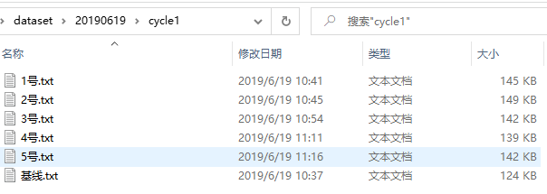

# elec_nose_plus
 气体传感器机器学习识别的威力加强版

 现在的是纯算法的前期版本，属于只能跑起来的类型

# 文件介绍
dataset里面没有传数据，数据结构：  
  
txt为传感器读取数据，第一列为时间数据，有效的仅为后6列。  

main.py为训练主文件

# 网络结构
输入1*6，即为单个单个的输入  (以后可能进行频谱转换后结合cnn输入)
双向lstm+fc，最后使用ctc作为loss训练。  
> 因为输入序列长度普遍在2k以上，而ctc的目标序列只有1个，所以可能训练时不稳定。但因为数据量过少，网络还是可以拟合的。  

# 结果分析
  
训练环境：win10，gtx1660s
训练时间：没进行计时，没跑多久，十分钟左右吧，样本很小。

左图训练集，右图测试集
红色为网络的预测，绿色为原始数据经过kmeans二分类后的时序标签

注意：**绿色不是真正的标签！源数据是只有一个总的分类，并没有全部时间进行打标，这也是为什么使用ctc进行训练的原因，具体参考语音序列的实时识别**